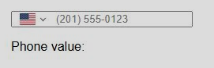
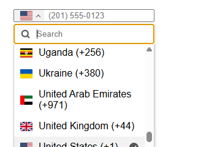

# angular-intl-tel-input

<div>
  
  
</div>

Standalone Angular component for international telephone input, built from [intl-tel-input](https://github.com/jackocnr/intl-tel-input).

## Prerequisites

- Node.js >= 22.6
- pnpm 10+
- CMake >= 3.20
- Git (for submodule init)

## Contributing

See [CONTRIBUTING.md](CONTRIBUTING.md) for instructions on how to set up your local environment, build the project, and run tests.

## Consumer usage

Import the component as a named export:

```ts
import { IntlTelInput } from 'angular-intl-tel-input';
```

Import the package stylesheet as well:

```css
@import "angular-intl-tel-input/styles";
```

Use Angular Signal Forms to bind the control:

```ts
import { Component } from '@angular/core';
import { FormField } from '@angular/forms/signals';
import { SignalFormControl } from '@angular/forms/signals/compat';
import { IntlTelInput } from 'angular-intl-tel-input';

@Component({
  imports: [IntlTelInput, FormField],
  template: `<intl-tel-input [formField]="phone.fieldTree" />`,
})
export class ExampleComponent {
  protected readonly phone = new SignalFormControl('');
}
```

`IntlTelInput` now integrates with Angular Signal Forms via `[formField]`.
Legacy Angular forms bindings are not supported by this package version:

- `[(ngModel)]`
- `[formControl]`
- `formControlName`

If you are migrating from an older version, replace those bindings with a
`SignalFormControl` and bind `phone.fieldTree` through `[formField]`.

`IntlTelInputWithValidation` is also exported as a named export.

## Package output

The built package in `dist/` is ready for `npm publish` as `angular-intl-tel-input`.
